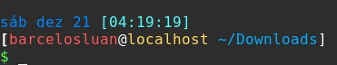

# Script de Instalação
> Made By: barcelosluan on 24-02-2020

---

### Windows :framed_picture:
	
	chocolateyPackages.ps1

1. Leia todo o documento e os scripts (se necessário atualize!) :bookmark_tabs:
2. Abra o prompt de comando `cmd` no modo administrador :warning:
3. Execute o arquivo `chocolateyPackages.ps1` :chocolate_bar:
4. __Divirta-se :smiley:__

---

### Ubuntu

1. Leia todo o documento e os scripts (se necessário atualize!) :memo:
2. 2. Execute a instalação dos programas essenciais `./*.sh`  :computer:
3. Faça o download dos aplicativos restantes :arrow_down:
	1. Fontes:
		1. [A Little Sunshine](https://www.dafont.com/pt/a-little-sunshine.font)
		2. [Angel Signature](https://www.dafont.com/angel-signature.font)
		3. [Orange Blossoms](https://www.dafont.com/orange-blossoms.font)
		4. [Callina](https://www.dafont.com/callina.font)
		5. [Great Wishes](https://www.dafont.com/great-wishes.font)
		6. [Honey Script](https://www.dafont.com/pt/honey-script.font)
		7. [Soul of You](https://www.dafont.com/pt/soul-of-you.font)
	2. [OpenJDK 13 - LTS](https://jdk.java.net/13/)
		1. Crie uma pasta `Aplicativos/Java` na `$HOME`
		2. Baixe o openjdk
		3. Mova o `openjdk-*.tar.gz` para a pasta `Aplicativos/Java`
		4. Descompacte o arquivo
		5. Mova a pasta `jdk-13*` para a pasta anterior
		6. Inclua o novo java no sistema
			```
			sudo tee /etc/profile.d/jdk-13.0.2.sh <<EOF
			export JAVA_HOME=/home/barcelosluan/Aplicativos/Java/jdk-13.0.2
			export PATH=\$PATH:\$JAVA_HOME/bin
			EOF
			```
		8. Recarregue o `$PATH`
			```
			source /etc/profile.d/jdk-13.0.2.sh
			```
		9. Confirme que a instalação ocorreu com sucesso
			```
			echo $JAVA_HOME
			java -version
			```
		10. `reboot`
	3. [Eclipse](https://www.eclipse.org/downloads/)
		1. Crie uma pasta `Workspaces/Java` na `$HOME`
		2. Crie uma pasta `Eclipse` na `$HOME/Aplicativos`
		3. Baixe o Eclipse
		4. Extraia o arquivo baixado
		5. Execute o arquivo `./eclipse-inst-linux64/eclipse-installer/eclipse-inst`
		6. Selecione `Eclipse IDE for Java Developers`
		7. Em `Java 1.8+ VM` selecione o `./*jdk-13 (Current)`
		8. Em `Installation Folder` selecione `$HOME/Aplicativos/Eclipse`
		9. Clique em `Install` e aceite os termos e por fim em `Launch`
		10. Selecione a `$HOME/Workspace/Java` como diretório padrão dos projetos
		11. Para criar o atalho de inicialização, é necessário ter o aplicativo `alacarte` (Menu Principal/Main Menu)
			* Abra o `alacarte`
			* Na aba `Desenvolvimento`, adicione um `Novo Item`
				```
				Nome: Eclipse
				Command: `$HOME/Aplicativos/Eclipse/eclipse/eclipse`
				Comment: Eclipse IDE
				Clique no quadrado em branco para adicionar um ícone e selecione `$HOME/Aplicativos/Eclipse/eclipse/icon.xpm`
				```
	4. [JetBrains Toolbox App](https://www.jetbrains.com/toolbox-app/)
	5. [Node.JS LTS](https://nodejs.org/en/download/)
		1. Baixe os Binários
		2. Descompacte na pasta que deseja instalar `/home/$USER/Aplicativos/NodeJS/*`
			```
			mkdir -p /home/$USER/Aplicativos/NodeJS
			tar -xJvf node-$VERSION-$DISTRO.tar.xz -C /home/$USER/Aplicativos/NodeJS
			```
		3. Adicione o Node.JS no `$PATH`
			```
			sudo nano ~/.profile
			
			# Nodejs
			export PATH=$PATH:/home/$USER/Aplicativos/NodeJS/*/bin:$PATH
			```
		4. Recarregue o `.profile` com o comando `. ~/.profile`
	6. [TeamViewer](https://www.teamviewer.com/pt-br/download/linux/)
	7. Opera
		1. Pode ser necessário instalar a versão mais recente da ffmpeg compativel para liberar a visualização de videos e gifs.
	8. [VirtualBox](https://www.virtualbox.org/wiki/Downloads)
	9. [Genymotion](https://www.genymotion.com/fun-zone/)
4. Faça o download das extenções do gnome :arrow_down:
	1. [Clipboard Indicator](https://extensions.gnome.org/extension/779/clipboard-indicator/)
	2. [Dash to Dock](https://extensions.gnome.org/extension/307/dash-to-dock/)
	3. [Hide Activities Button](https://extensions.gnome.org/extension/744/hide-activities-button/)
	4. [Hide Frequent View](https://extensions.gnome.org/extension/1367/hide-frequent-view/)
	5. [More Columns in Applications View](https://extensions.gnome.org/extension/1305/more-columns-in-applications-view/)
	6. [No Topleft Hot Corner](https://extensions.gnome.org/extension/118/no-topleft-hot-corner/)
	7. [Openweather](https://extensions.gnome.org/extension/750/openweather/)
	8. [Sound Input & Output Device Chooser](https://extensions.gnome.org/extension/906/sound-output-device-chooser/)
	9. [User Themes](https://extensions.gnome.org/extension/19/user-themes/)
5. Adicione WebApps com o `Gnome Web` (epiphany-browser) e atualize o icone com o `Menu Principal` (alacarte) :globe_with_meridians:
	1. [MS Excel](https://www.office.com/launch/excel?auth=1)
	2. [MS OneNote](https://www.onenote.com/notebooks?auth=1)
	3. [MS PowerPoint](https://www.office.com/launch/powerpoint?auth=1)
	4. [MS Word](https://www.office.com/launch/word?auth=1)
	5. [Notion](https://www.notion.so/onboarding)
	6. [WhatsApp Web](https://web.whatsapp.com/)
6. Altere/Adicione atalhos do teclado pesquisando por `teclado` no menu do sistema :keyboard:
	1. `CTRL+SHIFT+ESC` = `gnome-system-monitor`
	2. `SUPER+E` = `nautilus`
7. Icones e Temas
	1. Adicione os icones [delft](https://www.gnome-look.org/p/1199881/) ou [obsidian](https://www.gnome-look.org/p/1169579/) :triangular_flag_on_post:
		1. Extrair o pacote de icones
		2. Adicionar os icones à `/local/share/icons`
		3. Altere os icones com o Ajustes do Gnome
	2. Adicione os temas padrão do Gnome [Adwaita](https://www.gnome-look.org/p/1380461/)
		1. Extraia o pacote de themas
		2. Adicione-os à `/local/share/themes`
		3. Altere os temas com o Ajustes do Gnome
8. Configure o terminal para ficar mais legivel :shell:
	1. Entre no site [bashrcgenerator](http://bashrcgenerator.com/) e crie um esquema a seu gosto
		* Exemplo de bash personalizado:
	```
	export PS1="[$(tput bold)\]\[$(tput sgr0)\]\[\033[38;5;33m\]\d\[$(tput sgr0)\]\[$(tput sgr0)\]\[\033[38;5;15m\] \[$(tput bold)\]\[$(tput sgr0)\]\[\033[38;5;14m\][\T]\[$(tput sgr0)\]\[$(tput sgr0)\]\[\033[38;5;15m\]\n\[$(tput bold)\][\[$(tput sgr0)\]\[\033[38;5;9m\]\u\[$(tput sgr0)\]\[\033[38;5;15m\]@\[$(tput sgr0)\]\[\033[38;5;221m\]\h\[$(tput sgr0)\]\[$(tput sgr0)\]\[\033[38;5;15m\] \[$(tput bold)\]\[$(tput sgr0)\]\[\033[38;5;39m\]\w\[$(tput sgr0)\]\[\033[38;5;15m\]]\[$(tput sgr0)\]\n\[$(tput bold)\]\[$(tput sgr0)\]\[\033[38;5;10m\]\\$\[$(tput sgr0)\]\[$(tput sgr0)\]\[\033[38;5;15m\] \[$(tput sgr0)\]"
	```
	
9. __Divirta-se :smiley:__

---

### Debian :tornado:
	
	debianPackages.sh

1. Leia todo o documento e os scripts (se necessário atualize!) :memo:
2. Execute a instalação dos programas essenciais `./debianPackages.sh` :computer:
	1. Ao abrir o gedit para adicionar os repositorios `contrib non-free` basta substituir o conteúdo do arquivo `/etc/apt/sources.list` por:
	```
	deb http://deb.debian.org/debian buster main contrib non-free
	deb-src http://deb.debian.org/debian buster main contrib non-free

	deb http://deb.debian.org/debian buster-updates main contrib non-free
	deb-src http://deb.debian.org/debian buster-updates main contrib non-free

	deb http://security.debian.org/debian-security/ buster/updates main contrib non-free
	deb-src http://security.debian.org/debian-security/ buster/updates main contrib non-free
	```
3. Faça o download dos aplicativos restantes :arrow_down:
	1. Fontes:
		1. [Microsoft - mscorefonts2](https://sourceforge.net/projects/mscorefonts2/files/)
		2. [A Little Sunshine](https://www.dafont.com/pt/a-little-sunshine.font)
		3. [Angel Signature](https://www.dafont.com/angel-signature.font)
		4. [Orange Blossoms](https://www.dafont.com/orange-blossoms.font)
		5. [Callina](https://www.dafont.com/callina.font)
		6. [Great Wishes](https://www.dafont.com/great-wishes.font)
		7. [Honey Script](https://www.dafont.com/pt/honey-script.font)
		8. [Soul of You](https://www.dafont.com/pt/soul-of-you.font)
	2. [OpenJDK 13 - LTS](https://jdk.java.net/13/)
		1. Crie uma pasta `Aplicativos/Java` na `$HOME`
		2. Baixe o openjdk
		3. Mova o `openjdk-*.tar.gz` para a pasta `Aplicativos/Java`
		4. Descompacte o arquivo
		5. Mova a pasta `jdk-13*` para a pasta anterior
		6. Inclua o novo java no sistema
			```
			sudo tee /etc/profile.d/jdk-13.0.2.sh <<EOF
			export JAVA_HOME=/home/barcelosluan/Aplicativos/Java/jdk-13.0.2
			export PATH=\$PATH:\$JAVA_HOME/bin
			EOF
			```
		8. Recarregue o `$PATH`
			```
			source /etc/profile.d/jdk-13.0.2.sh
			```
		9. Confirme que a instalação ocorreu com sucesso
			```
			echo $JAVA_HOME
			java -version
			```
		10. `reboot`
	3. [Eclipse](https://www.eclipse.org/downloads/)
		1. Crie uma pasta `Workspaces/Java` na `$HOME`
		2. Crie uma pasta `Eclipse` na `$HOME/Aplicativos`
		3. Baixe o Eclipse
		4. Extraia o arquivo baixado
		5. Execute o arquivo `./eclipse-inst-linux64/eclipse-installer/eclipse-inst`
		6. Selecione `Eclipse IDE for Java Developers`
		7. Em `Java 1.8+ VM` selecione o `./*jdk-13 (Current)`
		8. Em `Installation Folder` selecione `$HOME/Aplicativos/Eclipse`
		9. Clique em `Install` e aceite os termos e por fim em `Launch`
		10. Selecione a `$HOME/Workspace/Java` como diretório padrão dos projetos
		11. Para criar o atalho de inicialização, é necessário ter o aplicativo `alacarte` (Menu Principal/Main Menu)
			* Abra o `alacarte`
			* Na aba `Desenvolvimento`, adicione um `Novo Item`
				```
				Nome: Eclipse
				Command: `$HOME/Aplicativos/Eclipse/eclipse/eclipse`
				Comment: Eclipse IDE
				Clique no quadrado em branco para adicionar um ícone e selecione `$HOME/Aplicativos/Eclipse/eclipse/icon.xpm`
				```
	4. [JetBrains Toolbox App](https://www.jetbrains.com/toolbox-app/)
	5. [Node.JS LTS](https://nodejs.org/en/download/)
		1. Baixe os Binários
		2. Descompacte na pasta que deseja instalar `/home/$USER/Aplicativos/NodeJS/*`
			```
			mkdir -p /home/$USER/Aplicativos/NodeJS
			tar -xJvf node-$VERSION-$DISTRO.tar.xz -C /home/$USER/Aplicativos/NodeJS
			```
		3. Adicione o Node.JS no `$PATH`
			```
			sudo nano ~/.profile
			
			# Nodejs
			export PATH=$PATH:/home/$USER/Aplicativos/NodeJS/*/bin:$PATH
			```
		4. Recarregue o `.profile` com o comando `. ~/.profile`
	6. [TeamViewer](https://www.teamviewer.com/pt-br/download/linux/)
	7. Opera
		1. Pode ser necessário instalar a versão mais recente da ffmpeg compativel para liberar a visualização de videos e gifs.
	8. [VirtualBox](https://www.virtualbox.org/wiki/Downloads)
	9. [Genymotion](https://www.genymotion.com/fun-zone/)
4. Faça o download das extenções do gnome :arrow_down:
	1. [Appfolders Management](https://extensions.gnome.org/extension/1217/appfolders-manager/)
		* Organize os aplicativos da view em pastas a gosto
	2. [Clipboard Indicator](https://extensions.gnome.org/extension/779/clipboard-indicator/)
	3. [Dash to Dock](https://extensions.gnome.org/extension/307/dash-to-dock/)
	4. [Hide Activities Button](https://extensions.gnome.org/extension/744/hide-activities-button/)
	5. [Hide Frequent View](https://extensions.gnome.org/extension/1367/hide-frequent-view/)
	6. [More Columns in Applications View](https://extensions.gnome.org/extension/1305/more-columns-in-applications-view/)
	7. [No Topleft Hot Corner](https://extensions.gnome.org/extension/118/no-topleft-hot-corner/)
	8. [Openweather](https://extensions.gnome.org/extension/750/openweather/)
5. Adicione WebApps com o `Gnome Web` (epiphany-browser) e atualize o icone com o `Menu Principal` (alacarte) :globe_with_meridians:
	1. [MS Excel](https://www.office.com/launch/excel?auth=1)
	2. [MS OneNote](https://www.onenote.com/notebooks?auth=1)
	3. [MS PowerPoint](https://www.office.com/launch/powerpoint?auth=1)
	4. [MS Word](https://www.office.com/launch/word?auth=1)
	5. [Notion](https://www.notion.so/onboarding)
	6. [WhatsApp Web](https://web.whatsapp.com/)
6. Altere/Adicione atalhos do teclado pesquisando por `teclado` no menu do sistema :keyboard:
	1. `CTRL+SHIFT+ESC` = `gnome-system-monitor`
	2. `CTRL+ALT+T` = `gnome-terminal`
	3. `SUPER+E` = `nautilus`
	4. `ALT+TAB` = Alterar Janelas
	5. `SUPER+D` = Ocultar todas as janelas normais
7. Adicione os icones [delft](https://www.gnome-look.org/p/1199881/) ou [obsidian](https://www.gnome-look.org/p/1169579/) :triangular_flag_on_post:
	1. Extrair o pacote de icones
	2. Adicionar os icones à `/local/share/icons`
8. Configure o terminal para ficar mais legivel :shell:
	1. Entre no site [bashrcgenerator](http://bashrcgenerator.com/) e crie um esquema a seu gosto
		* Exemplo de bash personalizado:
	```
	export PS1="[$(tput bold)\]\[$(tput sgr0)\]\[\033[38;5;33m\]\d\[$(tput sgr0)\]\[$(tput sgr0)\]\[\033[38;5;15m\] \[$(tput bold)\]\[$(tput sgr0)\]\[\033[38;5;14m\][\T]\[$(tput sgr0)\]\[$(tput sgr0)\]\[\033[38;5;15m\]\n\[$(tput bold)\][\[$(tput sgr0)\]\[\033[38;5;9m\]\u\[$(tput sgr0)\]\[\033[38;5;15m\]@\[$(tput sgr0)\]\[\033[38;5;221m\]\h\[$(tput sgr0)\]\[$(tput sgr0)\]\[\033[38;5;15m\] \[$(tput bold)\]\[$(tput sgr0)\]\[\033[38;5;39m\]\w\[$(tput sgr0)\]\[\033[38;5;15m\]]\[$(tput sgr0)\]\n\[$(tput bold)\]\[$(tput sgr0)\]\[\033[38;5;10m\]\\$\[$(tput sgr0)\]\[$(tput sgr0)\]\[\033[38;5;15m\] \[$(tput sgr0)\]"
	```
	
9. __Divirta-se :smiley:__

---

### [Fedora :tophat:](https://github.com/barcelosluan/installScripts/blob/master/fedora_README.md)
	
	fedoraNVidiaDriver-Part-I.sh
	fedoraNVidiaDriver-Part-II.sh
	fedoraNVidiaOptimusDriver.sh
	fedoraPackages.sh

---
